 

<!-- HEADER SECTION -->
<h5 align="center" style="padding:0;margin:0;">Mariné du Plessis</h5>
<h5 align="center" style="padding:0;margin:0;">221326</h5>
<h6 align="center">Creative Production 410 (Interactive Development)</h6>
 

  <a href="https://github.com/username/projectname">
    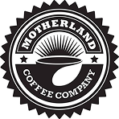
  </a>
  
  <h3 align="center">Motherland Coffee (Commercial Campaign)</h3>

    Interactive platform where users share what coffee means to them.  
    
    <a href="https://github.com/DupieM/DuPlessisMarine_221326_The_Thinking_Cabinet/issues">Report Bug</a>
    ·
    <a href="https://github.com/DupieM/DuPlessisMarine_221326_The_Thinking_Cabinet/issues">Request Feature</a>

<!-- TABLE OF CONTENTS -->
## Table of Contents

* [About the Project](#about-the-project)
  * [Project Description](#project-description)
  * [Built With](#built-with)
* [Getting Started](#getting-started)
  * [Prerequisites](#prerequisites)
  * [How to install](#how-to-install)
* [Features and Functionality](#features-and-functionality)
* [Concept Process](#concept-process)
   * [Ideation](#ideation)
   * [Wireframes](#wireframes)
   * [User-flow](#user-flow)
   * [ERD](#erd-diagram)
* [Development Process](#development-process)
   * [Implementation Process](#implementation-process)
        * [Highlights](#highlights)
        * [Challenges](#challenges)
   * [Reviews and Testing](#peer-reviews)
        * [Reviews](#feedback-from-reviews)
        * [Unit Tests](#unit-tests)
        * [UAT Tests](#uat-tests)
   * [Future Implementation](#peer-reviews)
* [Final Outcome](#final-outcome)
    * [Mockups](#mockups)
    * [Video Demonstration](#video-demonstration)
    * [Promotional Video](#promotional-video)
* [Roadmap](#roadmap)
* [Contributing](#contributing)
* [License](#license)
* [Contact](#contact)
* [Acknowledgements](#acknowledgements)

<!--PROJECT DESCRIPTION-->
## About the Project
<!-- header image of project -->
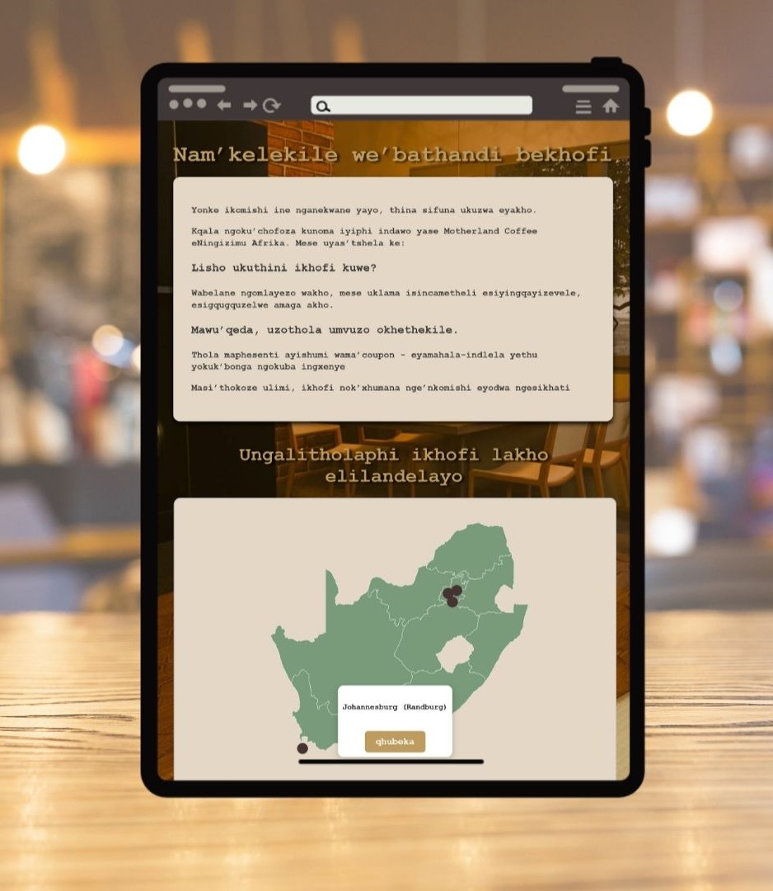

### Project Description

Interactive campaign created in response to the Pendoring Award 2025 theme: “Taal never die, We Multiply.” Partnering with Motherland Coffee Company, it celebrates South Africa’s cultural and linguistic diversity by turning the act of sharing coffee into an expression of connection and heritage. Customers can access the platform via social media adverts or in-store, translate the site into their home language, and send personalised coffee vouchers with custom digital stickers and messages in their mother tongue. Recipients receive the message along with a voucher redeemable at any Motherland Coffee store.

### Built With

* 
* 
* 
* 
* 
* 

<!-- GETTING STARTED -->
<!-- Make sure to add appropriate information about what prerequesite technologies the user would need and also the steps to install your project on their own mashines -->
## Getting Started

The following instructions will get you a copy of the project up and running on your local machine for development and testing purposes.

### Prerequisites

For development, you require to create an account on [Firebase](https://firebase.google.com/).

For sending emails you need to create an account on [Sendgrid](https://sendgrid.com/en-us) for API Key.

For making sure sendgrid does not stop create an account on [Render](https://render.com/) to keep sendgrid API Key running.

## How to install

### Installation
Clone the project repository as follow:

1. Go to Github Desktop and then click on clone new repository

2. Enter `https://github.com/DupieM/Motherland_Coffee.git` into the URL field and press the `Clone` button.

To start the Frontend React app do the following steps:

1. Go to Visual Studio Code   
  Open your Visual Studio Code then click on File and then click on Open folder.
  Then navigate to where you have cloned the repository and open it.

2. Start Terminal  
  Go to `Terminal` then click on new terminal

3. Navigate to frontend folder  
  Enter `cd frontend` to open the correct folder to start the app

4. Install dependencies  
  Enter `npm install` to get all the dependencies

5. Start the React App  
  Enter `npm start` to start

To start the backend do the following:

1. Navigate to the backend folder  
  Enter `cd backend` to open

2. Install dependencies  
  Enter `npm install` to get all the dependencies

3. Update .env file in the backend folder with your API Keys  
  `SENDGRID_API_KEY=SG.your_sendgrid_api_key`
  `SENDER_EMAIL=your_verified_sender_email`

4. Start the backend locally  
  Enter `npm start` to start

5. Deployment on Render  
  * Push your backend to GitHub.
  * Go to Render, create a new Web Service, connect it to your GitHub repo.
  * Add the same .env variables in Render’s Environment Variables tab.
  * Render will give you a live backend URL (e.g., https://your-backend.onrender.com).

Notes On Hosting
* Backend on Render must stay active (Render’s free tier sleeps after inactivity)
* SendGrid requires verified sender + free plan quota (100 emails/day).
* If Render goes to sleep, first request may take ~30 seconds to respond.

<!-- FEATURES AND FUNCTIONALITY-->
<!-- You can add the links to all of your imagery at the bottom of the file as references -->
## Features and Functionality

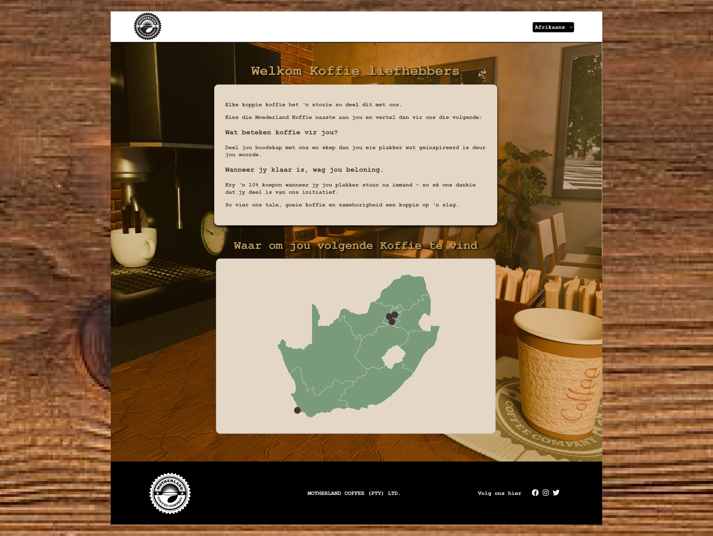

### Home Page

The home page welcomes coffee lovers and explains the project’s purpose. Users learn how they can share what coffee means to them, create a sticker, and receive a reward in return.

 

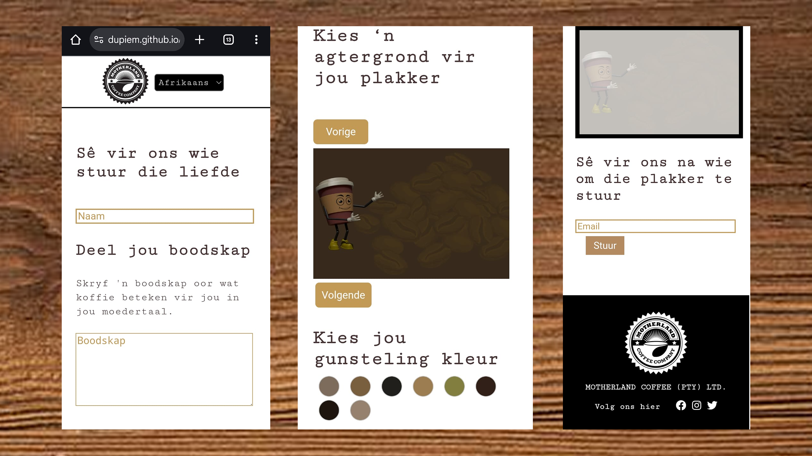

### Sticker Page

Here, users design their own digital sticker by entering their name and message, choosing a background, and selecting colours. Once ready, they can send the personalized sticker to a recipient via email.

 

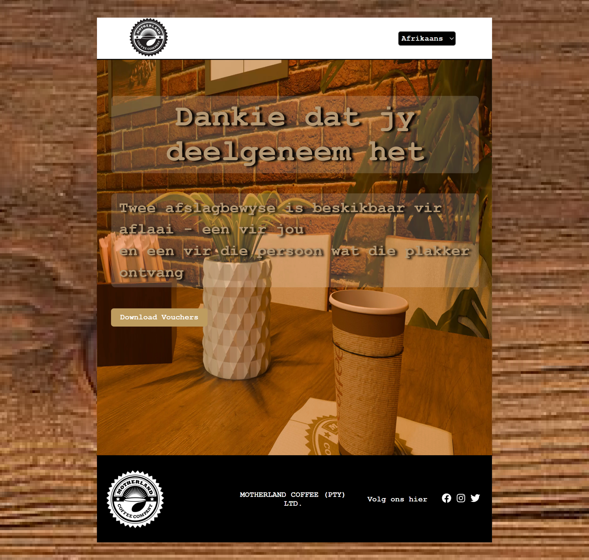

### Thank You Page

The thank you page confirms the user’s participation and expresses gratitude. It also provides a downloadable voucher as a reward for creating and sending a sticker.

<!-- CONCEPT PROCESS -->
<!-- Briefly explain your concept ideation process -->
## Concept Process

The `Conceptual Process` is the set of actions, activities and research that was done when starting this project.

### Ideation

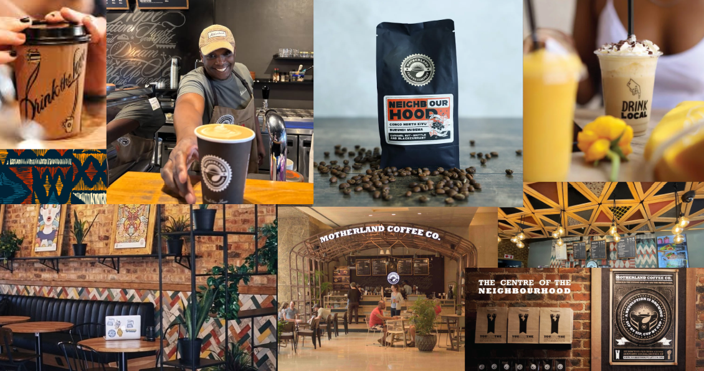
 
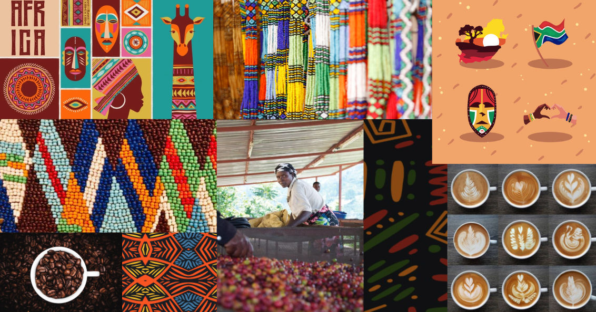

### Planned Wireframes

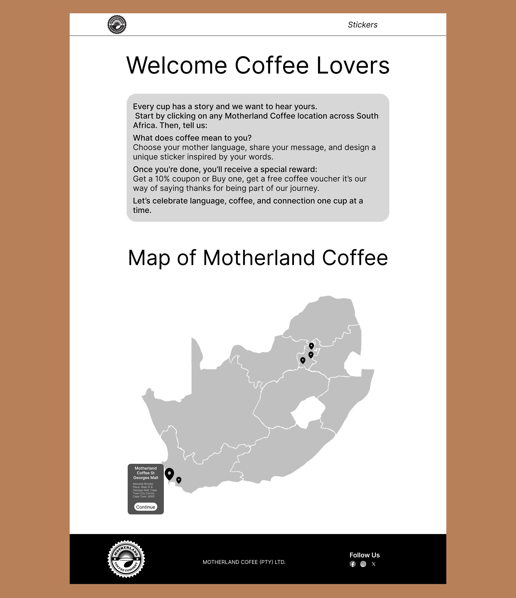
 
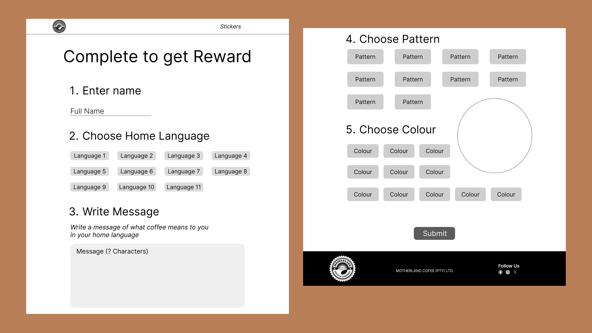
 
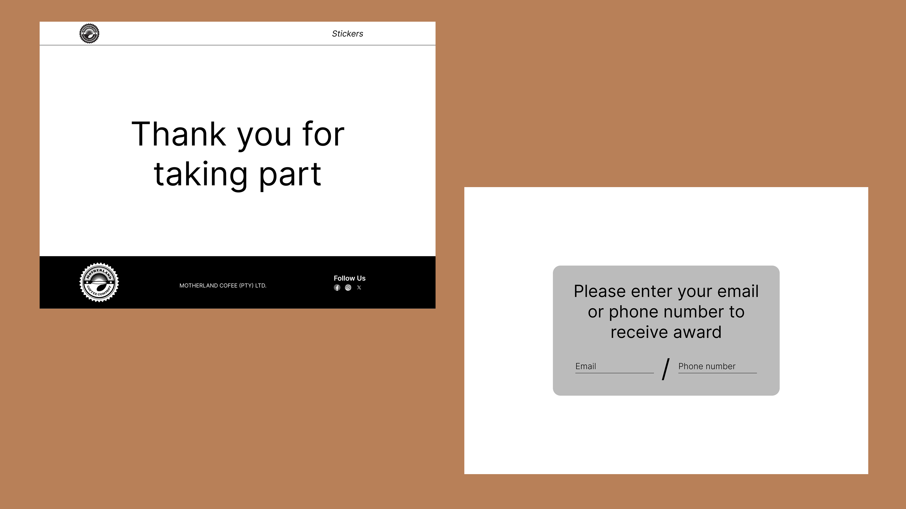

<!-- DEVELOPMENT PROCESS -->

## Development Process

The `Development Process` is the technical implementations and functionality done in the frontend and backend of the application.

### Implementation Process
<!-- stipulate all of the functionality you included in the project -->
 
* `React` 
* `Firebase` 
* `Render` 
* `Sendgrid` 

#### Highlights
<!-- stipulated the highlight you experienced with the project -->
* Users can design personalized stickers with custom names, messages, and background patterns.
* Making it a responsive design to view on web, iPad and mobile
* Animated route transitions for a modern and engaging user experience

#### Challenges
<!-- stipulated the challenges you faced with the project and why you think you faced it or how you think you'll solve it (if not solved) -->
* Adding a translation function to each page and then adding different languages to it
* Making it possible to send a sticker created on the website to an email adress, embedded as a HTML tag

### Reviews & Testing
<!-- stipulate how you've conducted testing in the form of peer reviews, feedback and also functionality testing, like unit tests (if applicable) -->
#### Unit Tests

`Unit Tests` were conducted to establish working functionality by myself.

* `Test 1` of confirming that the transaltion on each page works
* `Test 2` of confirming that the sticker component works
* `Test 3` of confirming it sends the email once the form is complete
* `Test 4` of confirming that transition screens works when moving between pages
* `Test 5` of confirming that email sending of sticker works
* `Test 6` of confirming that the vouchers are downloaded on thank you page in language chosen from translation

#### UAT Tests

`User Acceptance Testing` were conducted to establish working functionality by my peers.

* `Peer One` did a unit test to test if all the functionality was working perfectly.
* `Peer TWo` did a unit test to see if the emails are send out to correct email adress with sticker in email.

### Future Implementation
<!-- stipulate functionality and improvements that can be implemented in the future. -->

* Updating the background of stickers to be more creative

<!-- MOCKUPS -->
## Final Outcome

### Mockups

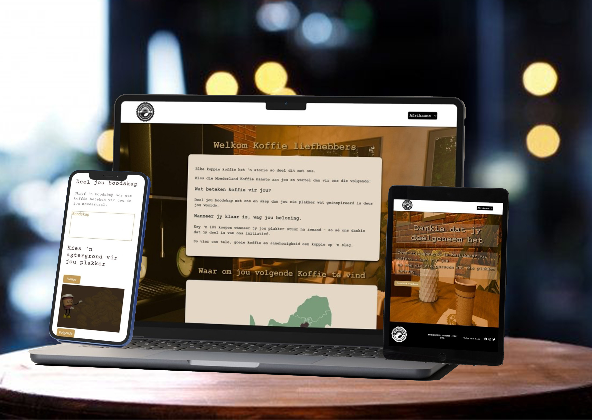
 

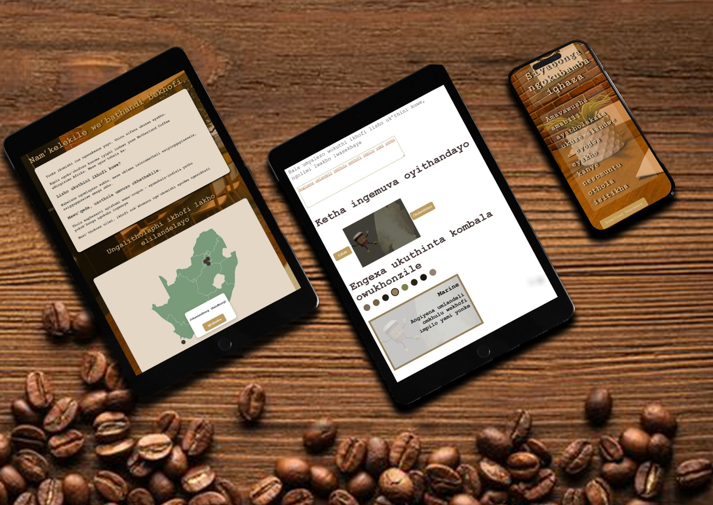
 

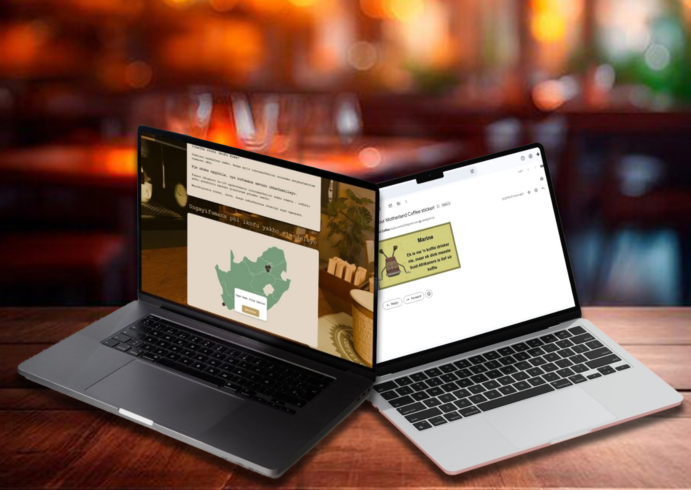
 

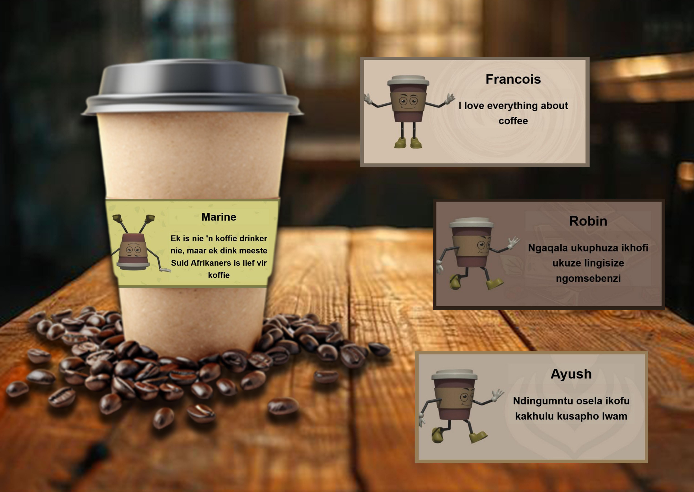
 

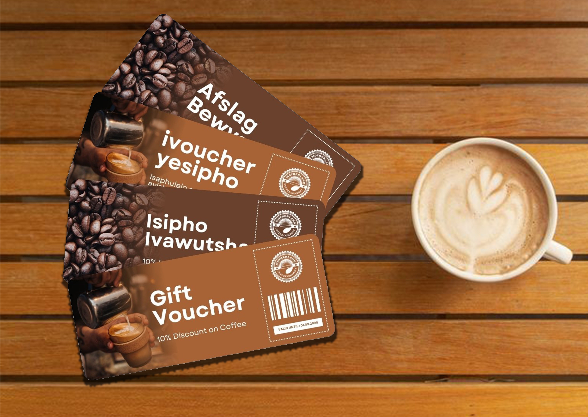
 

## Credits

* Robin Barnard - Advert, Overview Video
* Ayush Brathri - Character, 3D Design of Coffee Cafe
* Mariné du Plessis - Interactive Website

<!-- VIDEO DEMONSTRATION -->
### Overview Video

[View Demonstration](https://drive.google.com/file/d/1j77uP1TivFWPlCGN751Fxok_rS09zScr/view?usp=sharing)

<!-- ROADMAP -->
## Roadmap

See Future Implementation for a list of proposed features (and known issues).

<!-- CONTRIBUTING -->
## Contributing

Contributions are what makes the open-source community such an amazing place to learn, inspire, and create. Any contributions you make are **greatly appreciated**.

1. Fork the Project
2. Create your Feature Branch (`git checkout -b feature/AmazingFeature`)
3. Commit your Changes (`git commit -m 'Add some AmazingFeature'`)
4. Push to the Branch (`git push origin feature/AmazingFeature`)
5. Open a Pull Request

<!-- AUTHORS -->
## Authors

* **Mariné du Plessis** - [username](https://github.com/DupieM)

<!-- LICENSE -->
## License

Motherland Coffee reserved © 2025

<!-- LICENSE -->
## Contact

* **Mariné du Plessis** - [email@address](221326@virtualwindow.co.za) 
* **Project Link** - https://github.com/DupieM/Motherland_Coffee

<!-- ACKNOWLEDGEMENTS -->
## Acknowledgements
<!-- all resources that you used and Acknowledgements here -->
* [Firebase Documentation](https://firebase.google.com/docs?hl=en&authuser=1&_gl=1*oj3ulf*_ga*MTQzMDEzOTU3OS4xNzEyNTU2NTU1*_ga_CW55HF8NVT*MTcxODU1NTAxMS44NS4xLjE3MTg1NTgxMDAuNTkuMC4w)